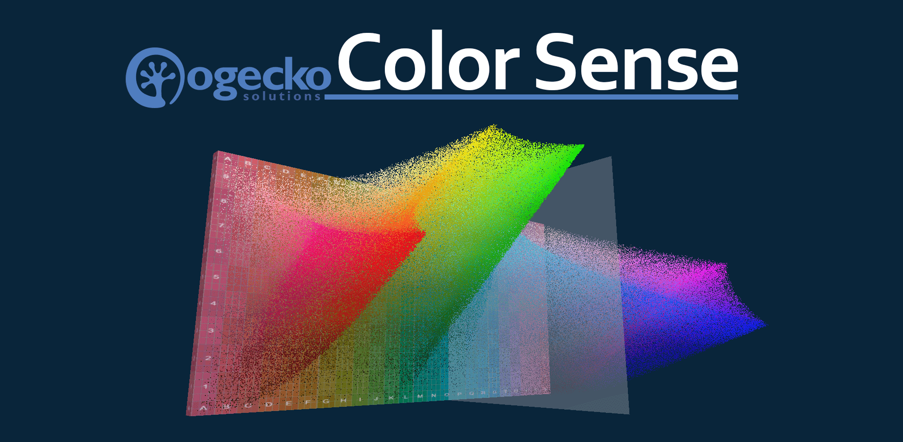

---
Make sense of the colors in a scene, picture or image using Color Sense. 

This app uncovers the dimensions of colour, light and edge perception. It is designed for realist painters using watercolor, traditional or digital media. 

## Selecting Images
You can import images from your Desktop, Camera, Smartphone or Tablet. On a Tablet or Smartphone, Select Image will allow you to choose an image from your Gallery or to take a picture with your camera. On the Desktop you can drag files from File Explorer into the application or Select Image will bring up a File Open Dialog box.

## Reviewing Images
Pan and zoom into an image fluidly showing all tones and colors. You can zoom into the image using the mouse wheel, menu item or using pinch on a touch device. You can also lock the position of the view using the padlock on the menubar to prevent accidentally panning the image with touch gestures while tracing on a tablet.

## HCL Color Space
Tap on a region to get a readout of a particular color, its HCL values and other colors with the same hue. Mark a region and you can get see where the colors are located in 3D HCL space. You can also add labels for the pigment colors you have in your palette. 

The three digit code is a shorthand for specifying a color in HCL space. For example, a vibrant red is coded '5C9', which stands for a Tone of 5 (0=Black, 5=Midtone, 10=White), a Hue Angle of 30' (A=0', B=15', C=30', ... Y=360') and a Chroma of 9 (0=greyscale, 10=saturated). A light terracotta color is coded '7D6', which stands for a light Tone of 7, a Hue angle of 45' and a Saturation of 6.

On a Desktop Mouse 1 rotates the HCL color space, Mouse 2 pans the color space and the Mouse Wheel zooms into the color space. On a Touch device, One Finger Drag rotates the HCL color space, Three Finger drag pans the color space and Pinch zooms the color space.

You can also view the tones as a 3D surface plot.

## Black and White
To see how well the image reads without color, uncheck Show Colors and zoom out. All Chroma and Hue are removed from the image and only the tone is shown.

## Thresholds
Select the number of tone thresholds to view the highlights, midtones and darks. The range of tones will be divided into the number of levels with the top and bottom levels having half the tone range of all other levels.

Selecting the Raise and Lower will adjust the number of levels. Selecting Levels once will remove any Masked Tones. Selecting Levels twice will remove the thresholds and go back to All Levels. 

## Hard and Soft Edges
To see which are hard or soft edges, check Show Soft Edges. Edges between tones that are soft are shown with a diagonal cross-hatch.

## Mask Dark Tones
Select levels 1, 2, upwards to mask the dark tones. This allows you to paint the light tones first, ignoring any dark tones that will be added in later.

## Mask Light Tones
Select the upper levels to mask the light tones. Leave at least two tones visible to see an edge. This can help when painting the darker tones as it removes the detail in the light tones.

## Increase Contrast
To trace a particular edge, mask the darks or lights, uncheck Show Colors, then check Max Contrast to more clearly see the edges.

## Multiple Monitors and Devices
This application supports Multiple Monitors and Devices. You can open different views on separate browser tabs, even on different monitors and across a Desktop and a Tablet at the same time. The application communicates to each view and keeps the settings in sync. For example, you can view the 3D HCL Color Space on one monitor, the original image on another, and a black and white version on a tablet for tracing - all at the same time.
