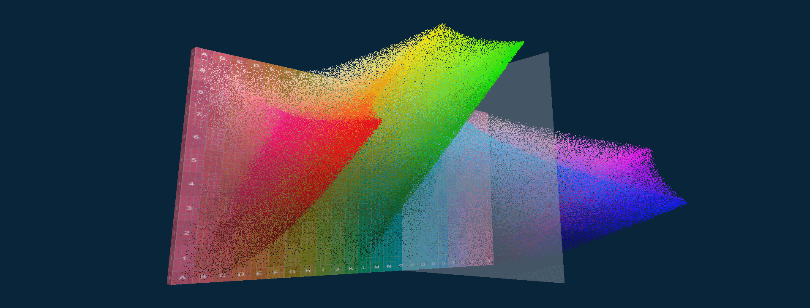

# color-sense

Make sense of the colors in a scene, picture or image using Color Sense. 

This app uncovers the dimensions of colour and light perception, designed for painters using watercolor, traditional or digital media. Create a balanced composition with shape and value by using a thumbnail sketch. Preserve the correct spots of white on the paper to make the highlights punch. Choose pigments that cover the gamut of hues and chromas in the design. Plan clean graded washes by understanding how the colors shift throughout the picture.

